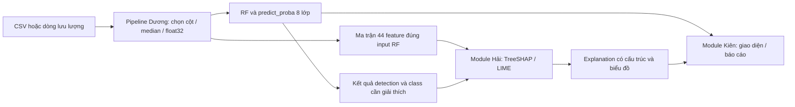

# Kế hoạch XAI: Random Forest + SHAP + LIME cho CICIoT2023

**Phụ trách chính:** Hà Minh Hải. **Phối hợp:** Nguyễn Ngọc Dương — dữ liệu/mô hình; Tạ Trung Kiên — tích hợp/đánh giá hệ thống.  
**Ngày lập:** 09/10/2026. **Trạng thái:** kế hoạch, chưa xác nhận triển khai hoặc nghiệm thu XAI.  
**Phạm vi:** phân loại 8 lớp; dùng RF baseline hiện tại để triển khai và phân tích trước khi Dương chốt model cuối. Các số liệu RF dưới đây là kết quả đã có, không phải kết quả XAI mới.

## 1. Mục tiêu và sản phẩm cần đạt

Xây dựng mô-đun giúp trả lời bốn câu hỏi:

1. Model RF dựa nhiều vào những đặc trưng nào trên toàn bộ mẫu nghiên cứu và từng lớp?
2. Vì sao một dòng lưu lượng cụ thể được dự đoán là Normal hoặc một loại tấn công?
3. Các ca BruteForce/Web-Based bị nhầm có đặc điểm gì khác với ca nhận diện đúng?
4. Giải thích có bám sát model, tái lập được và đủ nhanh để dùng trong hệ thống thử nghiệm không?

Sản phẩm chính: nền tảng lý thuyết; notebook/module SHAP và LIME; protocol giải thích; biểu đồ toàn cục/cục bộ; tập ca điển hình; bảng fidelity/ổn định/thời gian; API và ví dụ bàn giao; nội dung chương XAI trong báo cáo.

**XAI ở giai đoạn này giải thích và phân tích model đã có.** Nó không tự làm tăng recall, precision hoặc accuracy. Nếu phát hiện hướng cải thiện, Hải ghi giả thuyết và bằng chứng để Dương thực nghiệm riêng. Tiêu chí chất lượng detection và chất lượng explanation phải được báo cáo riêng.

## 2. Model được sử dụng và đầu vào đã có

### 2.1. Chốt đúng RF baseline

| Thành phần | Giá trị/đường dẫn tương đối từ gốc repository |
| --- | --- |
| Notebook tạo model | `notebook/ciciot2023-do-an-models.ipynb` |
| Run baseline | `output/model_experiments/models_20261008_073827_d29a37c3/` |
| Experiment | `RF_n1000000_none_s42` |
| Model độc lập | `experiments/RF_n1000000_none_s42/model.joblib` trong run baseline |
| Pipeline tích hợp | `handoff/RF/pipeline.joblib` trong run baseline |
| Metadata/schema | `handoff/RF/bundle_metadata.json`, `config.json`, `feature_schema.json`, `label_mapping.json`, `preprocessing_config.json` |
| Mẫu kiểm tra | `handoff/RF/golden_samples.npz`, `example_processed_features.csv` |
| Nguồn preprocessing | `output/processed_data/20261007_164739_35f682b9/` |
| Pilot train | `output/pilot_data/pilot_20261008_022915_ea9a88b0/train_1000000/` |
| Nhãn/dự đoán validation | `experiments/RF_n1000000_none_s42/validation/predictions.csv.gz`, `probabilities.npy` |
| Mask validation | `val_float32_kept_processed_indices.npy` ở gốc run baseline |

RF có 200 cây, `max_depth=20`, `min_samples_leaf=2`, `max_features='sqrt'`, `random_state=42`, `n_jobs=4`; train 1 triệu dòng, không class weighting. Estimator nhận 44 feature raw đã impute/chọn cột, dtype float32. Bộ preprocessing được cố định từ train nguồn.

SHA-256 model theo metadata: `5bb35f325f25c894cfc5aef07155ac40a81afdd8f52c55d731f88ec9fcd4b72d`. SHA-256 pipeline: `b5a06f972172aa27656bf2ba13a3056c48e5409807399bdbdbb11cf9fc829930`. Khi triển khai, phải đối chiếu lại artifact thực tế trên Kaggle với metadata; không dùng tên RF để thay cho kiểm tra định danh.

**Class order cố định:** `0 Normal`, `1 BruteForce`, `2 DDoS`, `3 DoS`, `4 Mirai`, `5 Recon`, `6 Spoofing`, `7 Web-Based`.

### 2.2. Hiệu năng RF để đặt câu hỏi XAI

| Chỉ số | Validation baseline | Test baseline đã xem |
| --- | ---: | ---: |
| Macro-F1 | 84,94% | 84,60% |
| Precision BruteForce | 89,71% | 89,62% |
| Recall BruteForce | 56,68% | 55,22% |
| Precision Web-Based | 42,34% | 40,74% |
| Recall Web-Based | 53,66% | 53,70% |

Test RF có accuracy khoảng 99,32%. Accuracy cao chưa trả lời được vì sao hai lớp hiếm có recall thấp. XAI cần tập trung cả ca bị bỏ sót và ca gán nhầm nhãn.

Các số liệu lấy từ [validation RF](../output/model_experiments/models_20261008_073827_d29a37c3/experiments/RF_n1000000_none_s42/validation/per_class_metrics.csv), [test RF](../output/model_experiments/models_20261008_073827_d29a37c3/test/RF_n1000000_none_s42/per_class_metrics.csv) và [bảng test](../output/model_experiments/models_20261008_073827_d29a37c3/final_test_comparison.csv). Dương vẫn chịu trách nhiệm lựa chọn metric/operating point/model cuối.

### 2.3. Giới hạn dữ liệu cần giữ nguyên

- Validation thực dùng: 808.943 dòng; test: 765.991 dòng, sau purge float32 bổ sung của baseline.
- Phải ánh xạ đúng từ `evaluation_row_index` sang `processed_row_index` bằng mask, rồi sang `source_row_index` trong metadata. Không giả sử chúng là cùng một chỉ số.
- Train chỉ dùng xây background/thống kê LIME; validation dùng phát triển và phân tích explanation. Test đã được xem nên chỉ có thể bổ sung minh họa hậu nghiệm với lịch sử công bố rõ.
- Không fit lại preprocessing, scaler hoặc model trong module XAI. Không đưa `label`, class ID hoặc sample ID vào feature.
- Giữ chính tả feature, đặc biệt `Magnitue`; lấy thứ tự 44 cột từ config, không sắp xếp alphabet hoặc tự đoán đơn vị.
- Chạy tính toán XAI trên Kaggle CPU. Local chỉ đọc artifact, sửa mã/tài liệu và kiểm tra tĩnh.

## 3. Cơ sở lý thuyết XAI cần học và viết

### 3.1. Khái niệm và các cách phân loại

Explainable AI cung cấp cách mô tả hành vi model bằng những thông tin con người có thể kiểm tra. Cần phân biệt **model dự đoán đúng** và **explanation mô tả đúng model**: model có thể sai nhưng explanation vẫn trung thực với hành vi sai đó.

| Phân biệt | Ý nghĩa | Áp dụng trong đồ án |
| --- | --- | --- |
| Intrinsic / post-hoc | Model dễ diễn giải trực tiếp / giải thích sau huấn luyện | RF dùng explanation post-hoc |
| Global / local | Hành vi trên tập mẫu / một dự đoán cụ thể | Global SHAP và local SHAP/LIME |
| Model-specific / model-agnostic | Dùng cấu trúc model / chỉ cần hàm dự đoán | TreeSHAP / LIME |
| Attribution / counterfactual | Phân bổ đóng góp / thay đổi gì để đổi dự đoán | Attribution là phạm vi chính |
| Fidelity / usefulness | Bám sát model / giúp người dùng hiểu hoặc xử lý ca | Đánh giá cả hai, với thước đo riêng |

Viết 1–2 trang về nhu cầu giải thích trong IDS: kiểm tra cảnh báo, phân tích nhầm lớp, phát hiện phụ thuộc bất thường vào feature và hỗ trợ người vận hành. Tham khảo cách tổ chức đánh giá của [Doshi-Velez & Kim, 2017](https://arxiv.org/abs/1702.08608) [R1].

Quy tắc diễn giải: SHAP/LIME mô tả model trong điều kiện và phân phối tham chiếu đã chọn; không chứng minh feature gây ra tấn công. Từ “interventional” trong một cấu hình SHAP cũng không tự làm dữ liệu quan sát trở thành thí nghiệm nhân quả. Đối chiếu thảo luận của [Janzing et al., 2020](https://proceedings.mlr.press/v108/janzing20a.html) [R11].

### 3.2. Random Forest và output cần giải thích

RF kết hợp nhiều cây được xây với bootstrap và lựa chọn ngẫu nhiên feature tại nút chia. Các cây học những ranh giới khác nhau; ensemble giảm phụ thuộc vào một cây riêng lẻ. Đây là cơ sở chọn TreeSHAP thay vì một explainer tổng quát tốn nhiều lần gọi model. [Breiman, 2001](https://www.stat.berkeley.edu/~breiman/randomforest2001.pdf) [R2].

Với RF scikit-learn, vector xác suất là trung bình xác suất lớp của các cây:

\[
p_c(x)=\frac{1}{T}\sum_{t=1}^{T}p_{t,c}(x),\qquad
\hat y=\arg\max_{c\in\{0,\ldots,7\}}p_c(x).
\]

Xác suất trong một cây được xác định từ phân bố lớp ở lá. Không mô tả `predict_proba` đơn giản là tỷ lệ cây bỏ phiếu nhãn cứng. Baseline hiện dùng argmax trực tiếp, chưa có nhân hệ số quyết định như run cải thiện XGBoost. Xem [RandomForestClassifier 1.6.1](https://scikit-learn.org/1.6/modules/generated/sklearn.ensemble.RandomForestClassifier.html) [R3].

XAI sẽ giải thích `p_c(x)` cho lớp c, không giải thích số nguyên nhãn 0–7. Giá trị xác suất model chưa đồng nghĩa với xác suất rủi ro được hiệu chỉnh cho môi trường triển khai.

### 3.3. Shapley values và SHAP

Xem feature là các thành viên trong một trò chơi hợp tác. Đóng góp feature j được tính bằng trung bình có trọng số phần thay đổi output khi thêm j vào các tập feature S:

\[
\phi_j(x)=\sum_{S\subseteq F\setminus\{j\}}
\frac{|S|!(M-|S|-1)!}{M!}
\left[v_x(S\cup\{j\})-v_x(S)\right],\quad M=44.
\]

`v_x(S)` phụ thuộc cách thay thế/tích phân các feature không có trong S. Vì vậy, phải ghi rõ phương pháp xử lý phụ thuộc feature và phân phối tham chiếu. Không tính trực tiếp toàn bộ coalition của 44 feature.

SHAP biểu diễn một output bằng dạng cộng:

\[
f_c(x)=\phi_{0,c}+\sum_{j=1}^{44}\phi_{j,c}(x).
\]

Nền tảng cần trình bày: local accuracy, missingness và consistency của additive feature attribution. Ví dụ trong probability space: base value 0,10 cộng các đóng góp có tổng 0,55 cho output 0,65; đóng góp +0,07 là +7 điểm phần trăm so với baseline, không phải “feature này có 7% khả năng gây tấn công”. Xem [Lundberg & Lee, 2017](https://arxiv.org/abs/1705.07874) [R4].

### 3.4. TreeSHAP và lựa chọn cấu hình cho RF

TreeSHAP khai thác cấu trúc cây để tính attribution, thay vì thử mọi tập con. Giá trị là kết quả cho model và cách định nghĩa game/phụ thuộc đã chọn; “exact” không có nghĩa là lời giải nhân quả duy nhất. Đọc [Lundberg et al., TreeSHAP](https://arxiv.org/abs/1905.04610) [R5].

**Cấu hình chính đề xuất:** `TreeExplainer(rf, feature_perturbation='tree_path_dependent', model_output='raw')`. Cấu hình này sử dụng thống kê các đường đi của train lưu trong model, không cần cung cấp background rời. Với RF scikit-learn, phải kiểm tra `base + sum(phi)` khớp `rf.predict_proba`; chỉ sau khi kiểm tra đạt mới gắn `output_space='probability'` trong báo cáo. Không suy luận `raw` luôn là log-odds như XGBoost.

**Đối chiếu tùy tài nguyên:** `interventional` với background train cố định và `model_output='probability'`, nếu phiên bản/model hỗ trợ. Background 100–200 dòng bắt đầu; chỉ giải thích khoảng 32 ca chung để kiểm tra độ nhạy. Không trộn hai cấu hình vào cùng bảng như một experiment. Các tham số và giới hạn được nêu trong [TreeExplainer documentation](https://shap.readthedocs.io/en/latest/generated/shap.TreeExplainer.html) [R6].

Hai cách không phải hai tên gọi của cùng một phân phối: tree-path dùng trọng số đường đi; interventional dùng background explicit. Không gọi tree-path là ước lượng chính xác mọi quan hệ phụ thuộc của dữ liệu. Background thay đổi có thể làm thay đổi base value và attribution.

### 3.5. LIME và mô hình thay thế cục bộ

LIME sinh các điểm lân cận z, gọi model gốc để lấy output, rồi học surrogate đơn giản g mô tả hành vi quanh x:

\[
\xi(x)=\arg\min_{g\in G}
\left[L(f,g,\pi_x)+\Omega(g)\right].
\]

`π_x` là trọng số khoảng cách; `L` đo sai lệch có trọng số; `Ω` giới hạn độ phức tạp. Trong đồ án dùng surrogate tuyến tính thưa, giải thích riêng xác suất một lớp của RF. Hệ số dương/âm mô tả chiều ảnh hưởng trong biểu diễn interpretable của LIME, không có cùng bảo đảm cộng với SHAP. Xem [Ribeiro et al., 2016](https://arxiv.org/abs/1602.04938) [R7].

Với dữ liệu bảng, feature liên tục có thể được rời rạc hóa thành khoảng; categorical được biểu diễn qua điều kiện bằng/khác giá trị của mẫu. Vì vậy phải lưu cả feature index và điều kiện như `IAT > ...`, không chỉ một tên feature. Seed, neighborhood size và kernel width ảnh hưởng explanation. Tham khảo [LimeTabularExplainer](https://lime-ml.readthedocs.io/en/latest/lime.html) [R8].

`score` của surrogate là weighted R² trên neighborhood dùng fit, không phải accuracy của RF. Cần đo thêm lỗi tại mẫu gốc và, nếu triển khai được, fidelity trên neighborhood kiểm tra độc lập. Đối chiếu [mã nguồn lime_base.py](https://github.com/marcotcr/lime/blob/master/lime/lime_base.py) [R9].

### 3.6. Đối chiếu SHAP, LIME và feature importance

| Tiêu chí | TreeSHAP | LIME | RF impurity importance |
| --- | --- | --- | --- |
| Mục đích | Attribution local; tổng hợp global | Surrogate local | Importance global của forest |
| Phụ thuộc | Cấu trúc cây, cách xử lý missing feature | Neighborhood, kernel, seed, surrogate | Các phép chia nút trong forest |
| Bảo đảm cần kiểm tra | Additivity trong đúng output space | Local fidelity; không có additivity SHAP | Không giải thích một dự đoán cụ thể |
| Hình thức | Đóng góp từng feature | Hệ số/điều kiện interpretable | Importance không âm |
| Vai trò | Phương pháp chính | Đối chiếu ca tiêu biểu | Tham khảo bổ sung |

Có thể thêm permutation importance trên một tập validation nhỏ, dùng macro-F1 làm scoring. MDI có thể thiên lệch với feature nhiều giá trị; permutation cũng khó diễn giải khi feature tương quan. Chỉ xem đây là đối chiếu phụ, không coi một ranking là “ground truth” cho ranking khác. [Tài liệu scikit-learn](https://scikit-learn.org/stable/modules/permutation_importance.html) [R10].

## 4. Cách sử dụng các paper trong `docs/`

| Paper | Nội dung nên kế thừa | Điều chỉnh cho đồ án này |
| --- | --- | --- |
| Le et al., 2023 — *Toward Enhanced Attack Detection and Explanation...* | Phân tích IDS bằng LIME và giải thích ca cụ thể; có hướng counterfactual | Giữ RF 8 lớp; counterfactual chỉ là phần mở rộng, không mặc định thêm blending model |
| Asry et al., 2025 — *Enhancing cybersecurity...* | SHAP và phân tích feature phục vụ nhận diện lớp ít mẫu | Phân biệt XAI giải thích RF với SHAP-RFECV thay đổi model; feature selection cần Dương thực nghiệm riêng |
| Balakrishnan & Maddikunta, 2026 — *Hybrid Ant-Baby Optimizer and BiLSTM...* | Cách tổ chức global/class-specific SHAP plots | Không thay RF bằng BiLSTM hoặc sao chép output space/model protocol của paper |
| Tseng et al., 2024 — *Multi-Class Intrusion Detection Based on Transformer...* | Tổng quan detection và bối cảnh đa lớp CICIoT2023 | Tham khảo phần detection; không lấy accuracy Transformer làm mục tiêu nghiệm thu XAI |

Tạo literature matrix khi thực hiện: dataset, số lớp, split, classifier, explainer, background, sample count, output space, fidelity/stability, thời gian, hạn chế. Mỗi phát biểu về paper phải có số trang/phần hoặc hình liên quan.

Tên “XGBoost + ShapRFECV” mô tả phương pháp của bài Asry, không phải một phần tên bài *Hybrid Ant-Baby Optimizer...*. Tách đúng bibliographic record. Tham khảo [R15–R18] và các PDF sẵn có trong `docs/`.

## 5. Kiến trúc tích hợp với phần của Dương



### 5.1. Hai luồng đầu vào cần hỗ trợ

**Luồng nghiên cứu:** lấy `X_val_raw.npy` đã xử lý, áp mask baseline rồi cast float32. RF nhận trực tiếp 44 cột; không đưa qua nhánh scaled. Nhãn/metadata tách riêng để phân nhóm ca.

**Luồng CSV tích hợp:** gọi pipeline đã bàn giao để prediction; lấy `pipeline[:-1].transform(frame_numeric)` làm input estimator và XAI. `pipeline.named_steps['model']` chính là RF. Đối chiếu xác suất của pipeline với estimator trước khi giải thích. Sử dụng cùng cách chọn cột/chuyển numeric/Inf→NaN như `predict_csv.py`.

Trong cả hai luồng, ghi giá trị trước xử lý nếu có và giá trị float32 estimator thực nhận. Explanation của feature đã impute phải hiển thị tình trạng thiếu dữ liệu; không trình bày median điền vào như số đo thật.

### 5.2. Contract chức năng đề xuất

Đây là thiết kế API, chưa phải file/module đã tạo:

```python
context = load_detection_bundle(bundle_dir)
explainer = build_explainers(context, xai_config, train_reference)
result = predict_and_explain(
    context, explainer, frame_or_processed_row,
    method="shap", target_class_id=None, sample_id=None,
)
```

- `target_class_id=None`: giải thích lớp dự đoán. Cho phép yêu cầu bất kỳ lớp 0–7 và runner-up.
- Một lần prediction được dùng chung cho detection và XAI; không có model riêng âm thầm trong module Hải.
- Adapter LIME trả ma trận xác suất `(n,8)` đúng class order, không trả nhãn cứng.
- Nhãn thật chỉ được thêm vào phần đánh giá offline; hệ thống chưa có nhãn không được hiển thị “dự đoán đúng”.
- Khi lỗi XAI: giữ kết quả detection, trả trạng thái explanation/error; không làm hệ thống mất prediction hoặc dựng lời giải thích giả.

### 5.3. Dương cần bàn giao cho Hải

- Bundle RF, model/config/schema, source run, mask, medians, versions và checksums.
- Sample IDs và bảng prediction đủ tám xác suất; confusion matrix và metric để chọn ca đúng/sai.
- Quy tắc quyết định hiện tại: RF argmax trực tiếp; thông báo nếu về sau có calibration hoặc decision multipliers.
- Từ điển feature: nguồn trích xuất, kiểu, miền giá trị và đơn vị được xác minh. Feature như `IAT`, `Weight`, `Duration` không được diễn giải đơn vị hoặc ý nghĩa chỉ dựa tên.

### 5.4. Hải trả lại cho Dương

Mỗi nhận xét ghi: nhóm mẫu, feature/điều kiện, số mẫu, output class, SHAP/LIME evidence, độ trung thực và giả thuyết. Ví dụ: “Trong nhóm BruteForce→Recon, feature A/B đóng góp nghiêng về Recon trên mẫu khảo sát; cần kiểm tra phân bố và thử nghiệm riêng.” Không kết luận “bỏ A sẽ tăng recall” chỉ từ attribution.

## 6. Protocol dữ liệu và chọn mẫu XAI

### 6.1. Các tập mẫu độc lập về mục đích

| Tập | Nguồn | Quy mô khởi đầu | Mục đích |
| --- | --- | ---: | --- |
| Golden/smoke | Bundle Dương + validation cố định | 16–32 dòng | Kiểm tra schema/output/additivity |
| Train reference LIME | Train pilot 1M | 50.000 dòng theo tỷ lệ lớp | Thống kê bins và phân phối categorical |
| Background đối chiếu SHAP | Train pilot 1M | 100–200 dòng | Interventional sensitivity |
| Global panel | Validation baseline | Tối đa 200 dòng/lớp, tổng ≤1.600 | Global/class-specific SHAP |
| Local comparison panel | Validation baseline | Khoảng 40 ca | SHAP–LIME, fidelity và case study |
| Stability panel | Tập local cố định | 16 ca | Seed/neighborhood sensitivity |

Mọi index, cách lấy mẫu và seed 42 được lưu trước khi tạo hình. Với lớp/nhóm không đủ mẫu, lấy số thực có và báo support; không nhân bản ca để đạt quota.

### 6.2. Tách tổng quan và ca minh họa

Global panel lấy ngẫu nhiên theo lớp, không cố ý chọn chỉ các ca có biểu đồ đẹp. Local panel có chủ đích để khảo sát loại lỗi và không đại diện cho toàn bộ traffic. Lưu rõ hai sampling policies.

Panel cân bằng lớp hỗ trợ quan sát rare attacks, nhưng mean importance trên nó không phải importance theo tần suất traffic gốc. Báo support và số fingerprint unique; kiểm tra độ nhạy theo nhóm trùng. Không coi các dòng cùng phiên/vector là quan sát độc lập chỉ vì sample ID khác nhau.

### 6.3. Kế hoạch chọn khoảng 40 ca local

- 16 ca: hai ca nhận diện đúng mỗi lớp.
- 16 ca bổ sung: mỗi lớp BruteForce/Web-Based lấy bốn FN và bốn FP; nếu thiếu, ghi quota thiếu.
- 4 ca Normal bị báo thành attack.
- 4 ca có margin top1–top2 thấp trên các lớp, sau khi loại trùng các ca đã chọn.

Một ca có thể thuộc nhiều nhóm; lưu danh sách group tags và đếm ca unique, không đếm một sample nhiều lần khi benchmark. Trong từng nhóm lấy theo seed và, nếu đủ support, phân bổ theo `original_label`. Lưu các ca dễ/khó hoặc confidence cao như một panel bổ sung với quy tắc xác định trước.

Khi sai nhãn tấn công, giải thích cả lớp RF dự đoán và lớp thật; khi không có nhãn thật, giải thích predicted và runner-up. Không đổi bài toán sang binary; phân biệt nhầm loại attack với nhầm sang Normal trong phần thảo luận.

## 7. Lộ trình triển khai theo thứ tự ưu tiên

### P0 — Chuẩn bị lý thuyết và xác minh bundle

**Công việc:** đọc R1–R8; viết ký hiệu; kiểm tra run/model/pipeline hash, `classes_`, 44 feature, dtype; nạp golden samples và đối chiếu `predict_proba`; tạo protocol version 1 cho XAI.

**Môi trường:** giữ phiên bản baseline, đặc biệt scikit-learn 1.6.1, NumPy 2.1.3 và Python 3.13.15. SHAP 0.52.0 đã xuất hiện trong run recall gần đây, có thể là điểm bắt đầu nhưng vẫn phải smoke-check RF. LIME cần ghi phiên bản thực tế sau khi xác minh API; không nâng toàn bộ môi trường chỉ để cài explainer.

**Đầu ra:** đề cương cơ sở XAI; `xai_protocol.json`, manifest đầu vào và smoke-check report dự kiến. **Nghiệm thu:** prediction estimator/pipeline khớp golden với `atol=1e-7, rtol=1e-6`; nếu sai, dừng trước giải thích.

### P1 — TreeSHAP local trước, kiểm tra output space

**Công việc:** giải thích 16–32 ca bằng cấu hình tree-path; chuẩn hóa tensor; kiểm tra tất cả lớp; tạo waterfall một ca đúng và một ca sai; lưu dữ liệu có cấu trúc trước khi vẽ.

Dạng nội bộ cần thống nhất là `(n_samples,44,8)` và base value broadcast thành `(n_samples,8)`. SHAP có phiên bản trả list theo lớp và phiên bản trả ndarray; phải xác nhận shape/axis từ API và kiểm tra additivity, không transpose theo cảm tính.

Đo cho từng i,c:

\[
e_{i,c}=\left|p_c(x_i)-\phi_{0,i,c}-\sum_j\phi_{i,j,c}\right|.
\]

Ngưỡng thiết kế ban đầu: `e <= 1e-5`; báo max/median/p95 và tỷ lệ pass trên toàn bộ output, không chỉ lớp dự đoán. Không nới tolerance để bỏ qua lỗi class order, preprocessing hoặc output space.

**Nghiệm thu:** tất cả probe đạt kiểm tra; feature/value/class khớp; explain cùng input/context không đổi prediction. Nguồn cấu trúc additivity: [R6].

### P2 — Global SHAP và phân tích từng lớp

**Công việc:** chạy global panel theo batch 32/64, checkpoint mỗi batch; không giải thích toàn validation 808.943 dòng ngay từ đầu. Lưu toàn bộ 44×8 attribution thay vì chỉ top10.

Tạo hai nhóm bảng có tên rõ:

\[
I^{all}_{j,c}=\frac{1}{N}\sum_i|\phi_{i,j,c}|,
\qquad
I^{true}_{j,c}=\frac{1}{n_c}\sum_{i:y_i=c}|\phi_{i,j,c}|.
\]

Nhóm thứ nhất giải thích output c trên toàn panel; nhóm thứ hai giải thích output c trên các mẫu thuộc lớp thật c. Không đặt chung tên “class importance” khi hai mẫu số khác nhau.

Tổng hợp chính cho panel cân bằng: `I_macro_true = mean_c(I_true[:,c])`. Nếu muốn góc nhìn population, dùng sampling weights gắn với tỷ lệ lớp validation baseline và ghi công thức; không dùng trung bình panel cân bằng rồi gọi là prevalence-weighted.

**Biểu đồ:** bar top20 toàn cục; heatmap 44×8; beeswarm riêng output Normal/BruteForce/Web-Based; bảng true-class importance đủ 8 lớp; dependence plot cho 3–5 feature được chọn bằng quy tắc ranking. Feature tương quan cần nêu cả nhóm, không kết luận một feature dư thừa chỉ vì importance nhỏ. Plot dùng [beeswarm](https://shap.readthedocs.io/en/latest/generated/shap.plots.beeswarm.html) [R12] và shape đã xác minh.

**Nghiệm thu:** bảng/hình có model hash, panel size, sampling policy, explainer config, output class/space; báo mean absolute attribution đúng tập mẫu.

### P3 — Local SHAP và phân tích ca đúng/sai

Mỗi case card gồm sample/source IDs, original_label nếu có, nhãn thật nếu có, nhãn dự đoán, tám xác suất, top1–top2 margin, waterfall predicted class, top feature dương/âm và additivity error.

Với ca sai, thêm explanation lớp thật và đối chiếu:

\[
p_a(x)-p_b(x)=(\phi_{0,a}-\phi_{0,b})+
\sum_j(\phi_{j,a}-\phi_{j,b}).
\]

Đây là phép trừ hai decomposition đã kiểm tra trong cùng output space, giúp xem feature nào nghiêng về a thay vì b. Nó không phải counterfactual hay bằng chứng có thể sửa traffic bằng một thay đổi cụ thể.

Phân tích ưu tiên BruteForce↔Normal/Recon và Web-Based↔Normal/Recon/Spoofing theo **confusion matrix RF**, không dùng confusion của XGBoost thay thế. Mỗi nhóm ghi số ca có sẵn, phân bố feature và giới hạn suy luận. Dùng [waterfall](https://shap.readthedocs.io/en/latest/generated/shap.plots.waterfall.html) [R13].

### P4 — LIME trên cùng panel để đối chiếu

**Cấu hình khởi đầu:** classification, `num_features=10`, `num_samples=5000`, discretization quartile cho feature liên tục, kernel width khởi đầu `0.75*sqrt(44)`, seed 42. Đây là cấu hình đề xuất phải benchmark, không phải kết quả tối ưu đã có.

**Kiểu dữ liệu:** kiểm tra unique values từ train trước khi đánh dấu categorical. Protocol code và flag/indicator thật sự rời rạc cần mapping categories; `ack_count`, `fin_count`, `Duration`, `Rate` không mặc định là category chỉ vì một số giá trị nguyên. Lưu mapping train-only. Nếu dùng mã liên tiếp cho LIME, adapter phải giải mã về giá trị feature RF thật trước `predict_proba`.

**Liên tục/tương quan:** lưu thống kê neighborhood có giá trị ngoài miền hoặc phá vỡ quan hệ giữa feature. Với vanilla LIME, công bố hạn chế đó; nếu thêm bộ sinh có ràng buộc, tạo cấu hình/method ID riêng và so sánh riêng. Không âm thầm clip neighborhood rồi báo là LIME mặc định. Cách sinh neighborhood tham khảo [lime_tabular.py](https://github.com/marcotcr/lime/blob/master/lime/lime_tabular.py) [R14].

Gọi giải thích từng target class riêng để fidelity tương ứng rõ ràng. Kiểm tra kiểu `score`/`local_pred` của phiên bản đã cài; không giả định luôn scalar hoặc luôn dictionary, hoặc lấy giá trị của lớp cuối cho tất cả lớp.

**Đầu ra:** feature indices, điều kiện interpretable, coefficient, intercept, surrogate output tại x, RF output, weighted R², point error, seed, kernel/neighborhood config và thời gian. Không gộp coefficient LIME với SHAP thành một thang giá trị chung.

### P5 — Đánh giá chất lượng và ổn định explanation

Thực hiện các thước đo tại mục 8. Dùng đúng cùng sample/target class khi so SHAP và LIME. Đánh giá LIME cả ca fidelity thấp, không chỉ giữ các explanation tốt.

Đối chiếu interventional SHAP trên tập nhỏ nếu ngân sách còn. Thay background train, ghi phương thức lấy mẫu và so top-k; balanced background chỉ là sensitivity study vì nó thay prior tham chiếu. Không nâng chất lượng bằng cách chọn background theo test.

### P6 — Tích hợp Kiên và nghiệm thu với Dương

Hải giao module, config/environment, mẫu JSON và ví dụ chạy pipeline RF. Kiên nối prediction với explanation trong giao diện, đo end-to-end riêng. Dương xác nhận feature/output/model đúng bundle.

Kịch bản tối thiểu: CSV đúng schema, mẫu thiếu giá trị được impute, sample không nhãn, target class bất kỳ, XAI lỗi/timeout, model hash không khớp, nạp lại context, cùng row nhiều requests. Các checks này là công việc tương lai cần thực hiện, chưa được tick.

## 8. Thước đo đánh giá XAI và điều kiện nghiệm thu

| Nhóm | Cách đo | Điều kiện/diễn giải |
| --- | --- | --- |
| Đúng prediction | Pipeline vs RF vs artifact golden | Pass trước chạy XAI |
| Additivity SHAP | Max/median/p95 residual trên 8 lớp | Ngưỡng thiết kế 1e-5; lỗi semantic không được bỏ qua |
| LIME point fidelity | `abs(p_c(x)-g_c(x'))` | Báo mọi ca; mục tiêu tham khảo ≤0,05 |
| LIME neighborhood fidelity | Weighted R²; thêm held-out weighted R²/MAE nếu có | Mục tiêu tham khảo R²≥0,8; không phải tiêu chuẩn phổ quát |
| Tái lập cố định | Cùng model/input/config/seed | SHAP khớp tolerance; LIME khớp cùng quy trình khởi tạo |
| Seed sensitivity | LIME 42/2026/3407 trên 16 ca | Top-k Jaccard, sign agreement, fidelity std |
| Reference sensitivity | SHAP background/interventional configs | So riêng cùng method; ghi baseline thay đổi |
| SHAP–LIME agreement | Top10 overlap và hướng ảnh hưởng | Chỉ chỉ số mô tả, không chứng minh correctness |
| Hiệu năng | Warm/cold latency, median/p95, peak RSS | Cùng CPU, sample và target; tách prediction/XAI/plot |
| Hữu ích cho người xem | Rubric case cards, feedback thành viên | Không gọi là đánh giá chuyên gia nếu không có chuyên gia |

`Jaccard(A,B)=|A∩B|/|A∪B|`. So sign trên feature có mặt ở cả hai top-k và đóng góp vượt epsilon; nếu LIME đã discretize, so sign chỉ là proxy vì hai phương pháp không giải thích cùng biểu diễn. Có thể báo Spearman ranking trong từng phương pháp; không dùng hệ số tương quan thấp để tự kết luận LIME sai.

`R²` có thể âm hoặc không xác định khi output neighborhood gần hằng; ghi null/reason hoặc giá trị thực, không biến thành 1. Point fidelity tốt chưa chứng minh neighborhood fidelity tốt. Các ngưỡng 0,05/0,8 là mục tiêu nhóm đề xuất, cần đóng băng sau pilot; không sửa sau khi xem hết ca để làm tỷ lệ đạt đẹp hơn.

Thước đo fidelity/sensitivity có nền tảng nghiên cứu trong [Yeh et al., 2019](https://arxiv.org/abs/1901.09392) [R19]; đây là gợi ý thiết kế đánh giá, không tuyên bố các proxy trên tương đương đầy đủ với định nghĩa trong paper.

Đánh giá human-facing đề xuất: 10 ca ẩn nhãn, ba thành viên đọc explanations theo rubric về tính rõ ràng, đúng lớp/output và khả năng truy vết; công bố cỡ mẫu nhỏ và người đánh giá là thành viên nhóm.

## 9. Ngân sách và cách tránh chạy quá lâu

1. Pilot 16–32 ca để đo SHAP giây/ca, LIME giây/ca, RAM và chi phí init/load.
2. Ước lượng `n×median`, cộng thời gian plot/export; chỉ mở rộng đến global 1.600 ca nếu ngân sách cho phép.
3. Ngân sách dự kiến ban đầu 8 giờ công việc CPU: khoảng 5 giờ SHAP, 2 giờ LIME, 1 giờ sensitivity/quality. Đây là giới hạn thiết kế, không dự báo đã đo.
4. Nếu quá chậm: giảm panel global xuống 100/lớp; giảm ca sensitivity hoặc background; ưu tiên đủ 8 lớp và đủ ca rare đúng/sai. LIME có thể pilot 2.000 perturbations trước 5.000. Mọi thay đổi lưu protocol revision và sample IDs.
5. Checkpoint từng batch/case, gồm trạng thái complete/failed, timing và checksums. Resume chỉ dùng cache khi model/input/config/reference hashes khớp.
6. Benchmark explanation không gồm vẽ hình; load/build explainer là cold-start riêng. Đo warm trên ít nhất 20 ca với support/target class công bố; LIME repeat khác seed thuộc sensitivity, không gộp vào latency một cấu hình.
7. Không chạy full validation/test hoặc tính SHAP interactions 44×44×8 ở vòng đầu. GPU không tự tăng tốc RF scikit-learn/TreeExplainer trong thiết kế này.

Nếu có cache, benchmark cả cache hit và uncached explanation; không dùng cache hit để báo tốc độ thuật toán. Khi phải giảm quy mô, báo thực tế thay vì kết luận tất cả mẫu đã được giải thích.

## 10. Contract đầu ra và cấu trúc artifact dự kiến

Một explanation record cần tối thiểu:

```json
{
  "schema_version": "1.0",
  "model_run_id": "models_20261008_073827_d29a37c3",
  "model_id": "RF_n1000000_none_s42",
  "model_sha256": "<verified hash>",
  "pipeline_sha256": "<verified hash>",
  "xai_run_id": "<new XAI run>",
  "sample_id": "<stable source ID>",
  "processed_row_index": "<integer when available>",
  "evaluation_row_index": "<integer when available>",
  "predicted_class_id": 1,
  "target_class_id": 1,
  "class_order": ["Normal", "BruteForce", "DDoS", "DoS", "Mirai", "Recon", "Spoofing", "Web-Based"],
  "method": "tree_shap_path_dependent",
  "output_space": "probability",
  "base_value": "<measured number>",
  "prediction": "<measured target-class probability>",
  "contributions": "<all 44 named feature contributions>",
  "top_k": 10,
  "additivity_error": "<measured number>",
  "elapsed_ms": "<measured duration>",
  "config_hash": "<hash>",
  "status": "complete"
}
```

Các placeholder là mô tả field, không phải dữ liệu thật; triển khai phải dùng kiểu số/array/object thích hợp. Thêm `true_class_id` chỉ khi có nhãn; LIME thêm conditions, intercept, fidelity và neighborhood config. Để tái kiểm tra additivity, luôn lưu đủ 44 contributions; top10 chỉ phục vụ hiển thị, feature còn lại được gộp thành “khác” bằng tổng có dấu khi cần waterfall ngắn.

Cấu trúc dự kiến khi được phép triển khai:

```text
notebook/ciciot2023-do-an-xai-rf.ipynb
output/xai_experiments/<xai_run_id>/
  run_status.json
  xai_protocol.json
  input_manifest.json
  environment.json
  requirements_runtime.txt
  samples/{global_indices,local_indices,train_reference,background_indices}
  shap/{values,base_values,additivity_report,global_importance,plots}
  lime/{explanations,fidelity,stability,plots}
  cases/{case_manifest,case_cards}
  benchmarks/{timings,summary,hardware}
  handoff/{xai_module.py,config,example_request,example_response}
  README_HANDOFF.md
```

Tên ở cây trên là nhóm artifact định hướng, không phải tất cả đã tồn tại. Mảng lớn có thể dùng NPY/NPZ; bảng CSV; metadata JSON; hình PNG/PDF. Không lưu million-row explanation chỉ vì còn disk. `.gitignore` hiện bỏ qua nhiều định dạng artifact; bàn giao toàn bộ run qua Kaggle output và kiểm tra nguồn trước staging.

## 11. Tích hợp vào giao diện của Kiên

- Trang/tệp kết quả detection: nhãn dự đoán, tám xác suất và model/run ID đang dùng.
- Nút “Giải thích dự đoán”: mặc định SHAP cho predicted class; cho chọn lớp khác để đối chiếu.
- Hiển thị top feature hỗ trợ/cản trở, giá trị estimator thực nhận, base value/output space, phương pháp và thời gian.
- Tab global hiển thị các bảng/hình đã tính offline; không recompute global SHAP mỗi request.
- LIME là tác vụ tùy chọn hoặc chạy bất đồng bộ nếu latency cao; hiển thị fidelity nếu có và tình trạng lỗi rõ ràng.
- UI dùng lời “model dựa vào…”; không ghi “feature này là nguyên nhân tấn công” hoặc tự hứa tăng accuracy.
- Cache key bao gồm model/pipeline hash, feature schema, canonical input hash, target class, method/config, seed/reference hash. Không cache chỉ theo sample ID.
- Nếu prediction đã có nhưng explanation timeout, vẫn hiển thị prediction. Kiên đo riêng total end-to-end, CSV parsing, preprocessing, model prediction, XAI và render/export.

## 12. Xử lý khi Dương đổi model hoặc quy tắc cuối

RF hiện tại là **model làm việc của XAI**, chưa phải xác nhận model detection cuối cùng. Module dùng adapter/interface để không phụ thuộc một đường dẫn cứng.

| Thay đổi | Việc bắt buộc làm lại |
| --- | --- |
| RF mới/cấu hình mới | Model hash, explainer, probabilities, global/local explanations, fidelity/timings và cases |
| Feature/preprocessing mới | Schema, giá trị hiển thị, train reference, categorical mapping, cả prediction và XAI checks |
| DT thay RF | TreeSHAP adapter và kiểm tra semantics/shape; LIME tiếp tục qua predict_proba |
| XGBoost thay RF | Xác minh raw margin/probability support; không đem SHAP margin cộng trực tiếp với probability |
| Calibration mới | Chốt output được giải thích; explanation RF gốc không mặc định giải thích calibrated probability |
| Decision multipliers mới | Prediction pipeline theo rule; trình bày riêng rule và attribution estimator; argmax probability có thể khác nhãn cuối |

Nếu dùng XGBoost raw multi-class margin, softmax cần áp lên **vector margin được tái tạo**, không áp riêng lên từng SHAP contribution để gọi là đóng góp xác suất. Mọi figure đưa vào báo cáo cuối phải gắn đúng model cuối; RF cũ chỉ giữ làm baseline có nhãn rõ.

Khi model thay đổi, không tái sử dụng cache hay ranking cũ. Dương và Hải chốt `explain_output` trước khi Kiên cập nhật hệ thống.

## 13. Lịch đề xuất và phối hợp ba thành viên

| Thời gian | Hải | Dương | Kiên | Mốc bàn giao |
| --- | --- | --- | --- | --- |
| 09–15/10 | Lý thuyết, P0/P1, local SHAP smoke | Xác nhận bundle/schema và định nghĩa feature | Chốt request/response, prototype trình bày | Explanation RF đầu tiên kiểm tra được |
| 16–22/10 | P2/P3, global và rare-case analysis | Đối chiếu lỗi, tiếp tục lựa chọn detection | Nối module SHAP với pipeline | Global/case cards bản 1 |
| 23–29/10 | P4/P5, LIME/fidelity/stability | Nhận giả thuyết cải thiện; không dùng test để sửa XAI cho đẹp | Benchmark tích hợp, timeout/cache | Bảng so SHAP–LIME và latency |
| 30/10–05/11 | P6, kiểm thử bàn giao, draft chương XAI | Đối chiếu model hiện hành | Hoàn thiện end-to-end | Module RF chạy với CSV và explanation |
| 06–20/11 | Tái tạo XAI cho model cuối nếu đổi, viết phân tích | Chốt model/output/metrics | Tích hợp phiên bản cuối, kiểm thử | Figures/bảng đúng model cuối |
| 21/11–05/12 | Rà trích dẫn, nghiệm thu, chuẩn bị câu hỏi bảo vệ | Rà dữ liệu/metrics | Đóng gói và diễn tập | Bản nộp/demo và backup |

Ngày là kế hoạch đề xuất, không phải deadline được nghiệm thu. Ưu tiên SHAP chạy đúng trước; không chờ Dương cải thiện recall xong mới bắt đầu XAI. Nếu model chưa chốt vào mốc cuối, báo rõ RF là baseline dùng minh họa thay vì ghi như kết quả cuối đã xác nhận.

## 14. Dàn ý nội dung báo cáo XAI

1. **Cơ sở lý thuyết:** taxonomy XAI; RF output; Shapley/SHAP/TreeSHAP; LIME; global/local; fidelity/ổn định và phụ thuộc feature.
2. **Phương pháp:** model/run/source; pipeline; train reference; panel selection; explainer configs; output space; class/feature mapping; protocol đánh giá.
3. **Kết quả:** bảng global/class-specific importance; beeswarm; waterfall đúng/sai; SHAP–LIME comparison; fidelity/stability; timing/RAM.
4. **Thảo luận:** vì sao một số rare attacks bị nhầm; vấn đề Normal false alarms; feature tương quan; sampling/background sensitivity; model limitation và giới hạn diễn giải.
5. **Tích hợp:** kiến trúc, API, request/response, cache/timeout, chuyển model và ví dụ CSV end-to-end.
6. **Kết luận và hạn chế:** XAI hỗ trợ kiểm tra hành vi; không thay thế đánh giá detection hoặc xác minh nhân quả; nêu phần đã làm/chưa làm thực tế.

Bộ hình tối thiểu đề xuất: 1 kiến trúc; 1 global bar; 1 heatmap 8 lớp; 3 beeswarm Normal/BruteForce/Web-Based; 8 waterfall cho 4 ca tiêu biểu gồm predicted/alternative khi cần; 4 hình LIME đối chiếu; bảng fidelity/stability và timing. Không cần vẽ hàng trăm hình trong báo cáo; dữ liệu gốc để ở artifact.

Mỗi caption ghi model ID, tập mẫu/support, target class, output space và phương pháp. Không dùng một beeswarm của Normal để kết luận tất cả attack classes.

## 15. Checklist nghiệm thu dự kiến

- [ ] Viết và trích dẫn lý thuyết XAI/RF/SHAP/LIME, phân biệt output space và causal claims.
- [ ] Xác minh RF/pipeline/schema/class order/golden samples với bundle Dương.
- [ ] Đóng băng XAI protocol, train reference và index panels.
- [ ] TreeSHAP đủ 8 output, additivity đạt trên mọi mẫu đã giải thích.
- [ ] Global và per-class importance/hình có sampling policy và support.
- [ ] Có case studies đúng/sai/false Normal alert, ưu tiên BruteForce/Web-Based.
- [ ] LIME dùng đúng adapter/class/category mappings; fidelity được lưu kể cả ca thấp.
- [ ] Có kiểm tra fixed-seed reproducibility và seed/reference sensitivity trong phạm vi thực chạy.
- [ ] Benchmark load/predict/SHAP/LIME/plot/end-to-end được tách rõ và có phần cứng.
- [ ] Kiên gọi được module cùng pipeline RF; prediction không đổi sau tích hợp XAI.
- [ ] Dương/Hải/Kiên xác nhận output schema, IDs và model version chung.
- [ ] Tái tạo explanations nếu model cuối/preprocessing/quy tắc quyết định thay đổi.
- [ ] Có README, môi trường, manifest/checksums và báo cáo giới hạn thực tế.

Danh sách chỉ là nghiệm thu tương lai. Việc tạo file kế hoạch không đánh dấu các task XAI hiện hành là đã hoàn thành.

## 16. References và mục đích sử dụng

Các tài liệu thuật toán/API dùng nguồn gốc hoặc tài liệu chính thức. API online có thể khác bản cài; khi triển khai phải lưu phiên bản và kiểm tra behavior thực tế. Ngày truy cập tài liệu web: **09/10/2026**.

### Nền tảng và thuật toán

- **[R1]** Doshi-Velez, F.; Kim, B. (2017). *Towards A Rigorous Science of Interpretable Machine Learning*. [arXiv:1702.08608](https://arxiv.org/abs/1702.08608). Dùng cho nhu cầu interpretability và thiết kế đánh giá.
- **[R2]** Breiman, L. (2001). *Random Forests*. Machine Learning, 45, 5–32. [DOI:10.1023/A:1010933404324](https://doi.org/10.1023/A:1010933404324); [PDF tác giả](https://www.stat.berkeley.edu/~breiman/randomforest2001.pdf). Dùng cho cơ sở RF.
- **[R3]** scikit-learn (1.6.1). [RandomForestClassifier](https://scikit-learn.org/1.6/modules/generated/sklearn.ensemble.RandomForestClassifier.html). Dùng cho behavior predict_proba và interface phù hợp artifact hiện tại.
- **[R4]** Lundberg, S. M.; Lee, S.-I. (2017). *A Unified Approach to Interpreting Model Predictions*. NeurIPS 2017. [arXiv:1705.07874](https://arxiv.org/abs/1705.07874). Dùng cho additive attribution và các tính chất SHAP.
- **[R5]** Lundberg, S. M. et al. (2020). *From local explanations to global understanding with explainable AI for trees*. Nature Machine Intelligence, 2, 56–67. [DOI:10.1038/s42256-019-0138-9](https://doi.org/10.1038/s42256-019-0138-9); [bản preprint 2019 với tiêu đề Explainable AI for Trees](https://arxiv.org/abs/1905.04610). Dùng cho TreeSHAP và tổng hợp local→global.
- **[R6]** SHAP. [TreeExplainer API](https://shap.readthedocs.io/en/latest/generated/shap.TreeExplainer.html). Dùng cho model_output, perturbation mode, shape và additivity.
- **[R7]** Ribeiro, M. T.; Singh, S.; Guestrin, C. (2016). *“Why Should I Trust You?”: Explaining the Predictions of Any Classifier*. KDD 2016, 1135–1144. [arXiv:1602.04938](https://arxiv.org/abs/1602.04938). Dùng cho objective LIME và local surrogate.
- **[R8]** LIME. [LimeTabularExplainer documentation](https://lime-ml.readthedocs.io/en/latest/lime.html). Dùng cho discretization, categorical features, kernel và seed.
- **[R9]** Ribeiro và các contributors. [lime_base.py](https://github.com/marcotcr/lime/blob/master/lime/lime_base.py). Dùng để kiểm tra surrogate coefficients, R² và local prediction; ghi phiên bản/commit khi triển khai.
- **[R10]** scikit-learn. [Permutation feature importance](https://scikit-learn.org/stable/modules/permutation_importance.html). Dùng cho đối chiếu MDI/permutation, ảnh hưởng scoring và correlated features.
- **[R11]** Janzing, D.; Minorics, L.; Blöbaum, P. (2020). *Feature relevance quantification in explainable AI: A causal problem*. AISTATS, PMLR 108, 2907–2916. [Bài gốc](https://proceedings.mlr.press/v108/janzing20a.html). Dùng cho phân phối tham chiếu và giới hạn causal interpretation.
- **[R12]** SHAP. [Beeswarm plot API](https://shap.readthedocs.io/en/latest/generated/shap.plots.beeswarm.html). Dùng cho global distribution plot theo output class.
- **[R13]** SHAP. [Waterfall plot API](https://shap.readthedocs.io/en/latest/generated/shap.plots.waterfall.html). Dùng cho local explanation một mẫu/một output.
- **[R14]** Ribeiro và các contributors. [lime_tabular.py](https://github.com/marcotcr/lime/blob/master/lime/lime_tabular.py). Dùng để đối chiếu neighborhood generation, categorical mapping và behavior multi-label explanation của bản cài.

### IDS và các bài đã có trong repository

- **[R15]** Le, T.-T.-H.; Wardhani, R. W.; Putranto, D. S. C.; Jo, U.; Kim, H. (2023). *Toward Enhanced Attack Detection and Explanation in Intrusion Detection System-Based IoT Environment Data*. IEEE Access. [DOI:10.1109/ACCESS.2023.3336678](https://doi.org/10.1109/ACCESS.2023.3336678). [PDF trong repository](../docs/Toward_Enhanced_Attack_Detection_and_Explanation_in_Intrusion_Detection_System-Based_IoT_Environment_Data.pdf). Dùng cho LIME/case explanation trong IDS, phạm vi counterfactual mở rộng.
- **[R16]** Asry, C. E. L.; Benchaji, I.; Douzi, S.; Ouahidi, B. E. L. (2025). *Enhancing cybersecurity: A high-performance intrusion detection approach through boosting minority class recognition*. PLOS ONE, 20(3), e0317346. [DOI:10.1371/journal.pone.0317346](https://doi.org/10.1371/journal.pone.0317346). [PDF trong repository](../docs/journal.pone.0317346.pdf). Dùng cho SHAP/feature selection và lớp thiểu số; không xem feature selection là explanation tích hợp đã hoàn thành.
- **[R17]** Balakrishnan, A.; Maddikunta, P. K. R. (2026). *Hybrid Ant-Baby Optimizer and BiLSTM framework for high-performance IoT intrusion detection*. Frontiers in Artificial Intelligence, 9:1795030. [DOI:10.3389/frai.2026.1795030](https://doi.org/10.3389/frai.2026.1795030). [PDF trong repository](../docs/frai-9-1795030.pdf). Dùng cho cách trình bày global/class-specific SHAP; classifier trong bài khác RF hiện tại.
- **[R18]** Tseng, S.-M.; Wang, Y.-Q.; Wang, Y.-C. (2024). *Multi-Class Intrusion Detection Based on Transformer for IoT Networks Using CIC-IoT-2023 Dataset*. Future Internet, 16(8), 284. [DOI:10.3390/fi16080284](https://doi.org/10.3390/fi16080284). [PDF trong repository](../docs/futureinternet-16-00284-v2.pdf). Dùng cho bối cảnh detection/đa lớp và đối chiếu protocol, không đặt tiêu chí XAI bằng accuracy paper.

### Đánh giá explanation và dữ liệu

- **[R19]** Yeh, C.-K. et al. (2019). *On the (In)fidelity and Sensitivity for Explanations*. NeurIPS 2019. [arXiv:1901.09392](https://arxiv.org/abs/1901.09392). Dùng cho thiết kế đánh giá fidelity/sensitivity, với phạm vi proxy công bố rõ.
- **[R20]** Neto, E. C. P. et al. (2023). *CICIoT2023: A Real-Time Dataset and Benchmark for Large-Scale Attacks in IoT Environment*. Sensors, 23(13), 5941. [DOI:10.3390/s23135941](https://doi.org/10.3390/s23135941); [trang CIC/UNB chính thức](https://www.unb.ca/cic/datasets/iotdataset-2023.html). Dùng cho dataset, mapping/bối cảnh attack và feature provenance; số liệu run phải lấy từ artifact của dự án.

### Nguồn nội bộ cần đọc khi thực hiện

- [Bàn giao detection baseline](../output/model_experiments/models_20261008_073827_d29a37c3/README_HANDOFF.md): cách nạp RF/pipeline, preprocessing và giới hạn evaluation.
- [Kế hoạch Hải 01](Ha_Minh_Hai_01_thiet_ke_xai.md), [Hải 02](Ha_Minh_Hai_02_trien_khai_shap_lime.md), [Hải 03](Ha_Minh_Hai_03_phan_tich_toan_cuc_cuc_bo.md), [Hải 04](Ha_Minh_Hai_04_kiem_chung_danh_gia_xai.md), [Hải 05](Ha_Minh_Hai_05_bao_cao_ban_giao.md): checklist theo trách nhiệm.
- [Phân công nhóm](README.md): dependencies và vai trò Dương/Hải/Kiên. File kế hoạch này bổ sung chi tiết XAI; không tự thay trạng thái các checklist khác.
